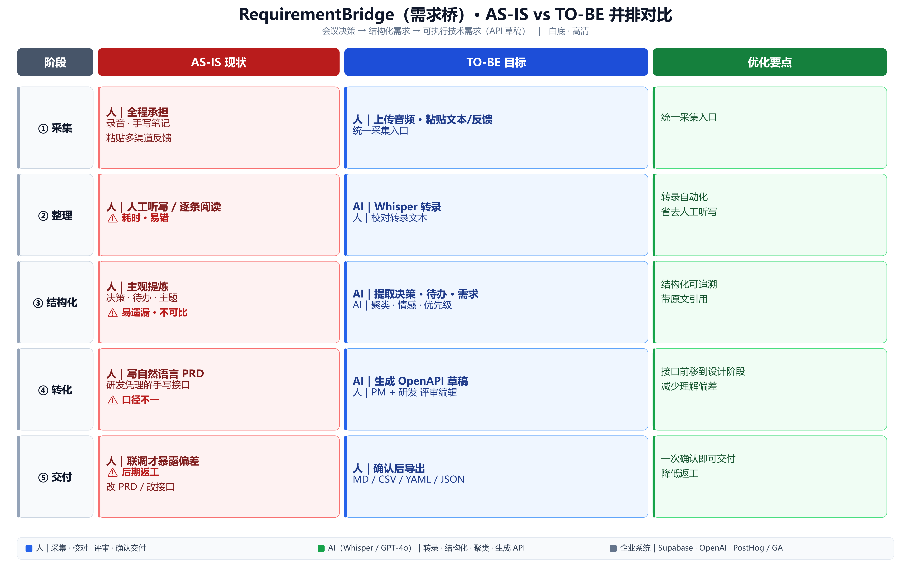
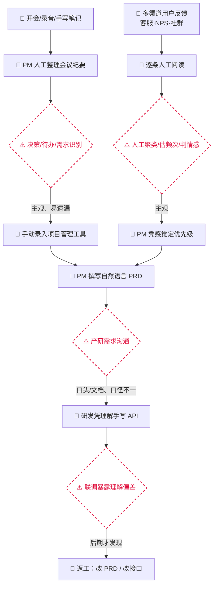
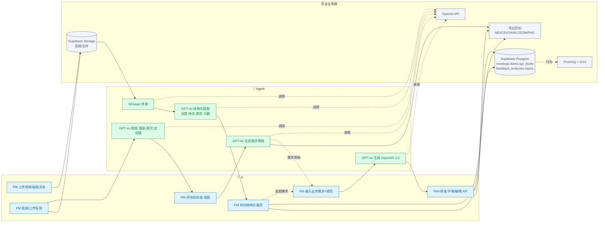

# RequirementBridge（需求桥）业务流程图

| 项 | 内容 |
|---|---|
| 文档版本 | v0.1 |
| 日期 | 2026-07-27 |
| 范围 | 会议决策 → 结构化需求 → 可执行技术需求（API 草稿） + 反馈洞察 |
| 包含 | ① AS-IS 现状流程 ② 问题环节 ③ TO-BE 目标流程 ④ 人 / Agent / 企业系统分工 |

---

## 0. 总览：AS-IS vs TO-BE 并排对比（高清大图）

> 同一坐标系下的四列五行矩阵：`阶段 | AS-IS 现状 | TO-BE 目标 | 优化要点`，逐行对照。
> 配色含义：蓝 = 人、绿 = AI（Whisper/GPT-4o）、灰 = 企业系统。

高清矢量版见 `docs/images/flow-compare.svg`；三张分图见 `docs/images/flow-asis.png`、`flow-tobe.png`、`flow-diff.png`。

---

## 1. 图例（颜色 / 形状约定）

| 含义 | 标记 |
|---|---|
| 👤 人（PM / 研发） | 圆角矩形，蓝 |
| 🤖 Agent（Whisper / GPT-4o） | 矩形，绿 |
| 🗄️ 企业系统（Supabase / Storage / OpenAI / 导出目标 / PostHog·GA） | 圆柱/平行四边形，灰 |
| ⚠️ 问题环节 | 红色虚线边框 |
| → 数据/动作流向 | 实线箭头 |
| ⇢ 可选/未来扩展 | 虚线箭头 |

> Mermaid 图可在 GitHub / VS Code 直接渲染。下方同时提供文字版分工矩阵。

---

## 2. AS-IS 现状流程（人工为主，AI 缺位）

**核心问题环节（红框）**
1. 决策/待办/需求识别 —— 主观、易遗漏、负责人常缺失。
2. 产研需求沟通 —— 口径不一，需求歧义在所难免。
3. 联调暴露理解偏差 —— 发现晚，返工成本高。
4. 反馈聚类/频次/情感 —— 人工估算，主观且不可比。

---

## 3. TO-BE 目标流程（人 / Agent / 企业系统 泳道）

> 端到端主链路（会议决策 → 任务/需求 → API 草稿），反馈洞察作为需求来源之一回灌。

**TO-BE 关键变化**
- 会议：转录 + 结构化**由 Agent 一次完成**，人只做**校对**；待办自带负责人/优先级/原文引用。
- API：业务需求 → **OpenAPI 草稿由 Agent 直出**，产研基于同一份接口定义评审，把"理解偏差"前移到设计阶段。
- 反馈：聚类/频次/情感**由 Agent 量化**，优先级建议可追溯，并可一键生成需求草稿回灌主链路。
- 落地动作仍由**人确认 + 导出**，Agent 不直接写入外部业务系统（v1 边界）。

---

## 4. 人 / Agent / 企业系统 分工矩阵

| 环节 | 👤 人（PM / 研发） | 🤖 Agent（Whisper / GPT-4o） | 🗄️ 企业系统 |
|---|---|---|---|
| 会议输入 | 选输入方式、上传/粘贴、发起分析 | （等待） | Supabase Storage 存音频；OpenAI 待调用 |
| 转录 | 必要时校对转录文本 | **Whisper 语音转文本** | Storage→OpenAI 链路；状态机置 `transcribing` |
| 结构化提取 | 校对/编辑/改优先级/改负责人/增删条目 | **GPT-4o 提取决策·待办·需求·问题 + 摘要** | Postgres 落 `meetings`/`meeting_items` |
| API 草稿输入 | 写业务需求 + 团队 API 规范 | （等待） | Postgres 落 `api_drafts` |
| API 生成 | 评审、编辑 YAML、保存版本、重新生成 | **GPT-4o 生成 OpenAPI 3.0（含错误码/Schemas）** | OpenAI 调用；YAML 实时校验 |
| 反馈输入 | 粘贴/上传、指定 CSV 反馈列 | （等待） | Storage 存文件 |
| 反馈分析 | 评估优先级、合并/编辑/删除主题、选题 | **GPT-4o 聚类·命名·摘要·频次·情感·优先级·样本** | Postgres 落 `feedback_analyses`/`feedback_topics` |
| 需求草稿 | 编辑、决定是否进入 API 设计 | **GPT-4o 基于选中主题生成需求草稿** | 导出 MD/CSV |
| 导出与外溢 | 选择格式、复制/下载、（未来）回写外部系统 | （不参与） | 生成 MD/CSV/YAML/JSON/PNG；PostHog/GA 上报 |
| 全链路 | **决策与确认的唯一主体** | 结构化/生成/聚类的"执行手" | 存储·调用·上报的"管道" |

> 设计原则：**人定方向、做确认；Agent 做结构化与生成；系统做存取与上报。** Agent 不直接对业务系统产生写副作用（v1）。

---

## 5. AS-IS → TO-BE 改进点对照

| 问题环节（AS-IS） | TO-BE 解法 | 责任方 |
|---|---|---|
| 决策/待办识别主观、易遗漏 | Whisper+GPT-4o 结构化提取，带原文引用与负责人建议 | Agent |
| 待办无负责人、难跟进 | 提取时识别 assignee，缺失则标"待分配"，供 PM 校对 | Agent + 人 |
| 产研需求口径不一 | 自然语言需求 → 标准 OpenAPI 草稿，产研同源评审 | Agent + 人 |
| 联调才暴露理解偏差 | 接口定义前移到设计阶段，可视化+校验减少歧义 | Agent + 人 |
| 反馈分散、聚类主观 | 自动聚类+频次+情感+优先级，可追溯、可比较 | Agent |
| 三环节割裂、人工搬运 | 反馈主题可生成需求草稿并回灌 API 设计（人主导串联） | 人 + Agent |

---

## 6. 未来扩展（虚线、非 v1）

- ⇢ 会议需求 → API 设计器 / 需求池的**自动串联**。
- ⇢ 导出结果**回写** Jira / 飞书 / Linear / Swagger / Postman。
- ⇢ 说话人分离（Diarization）提升 assignee 识别。
- ⇢ API 草稿的 **Mock Server / SDK 生成 / 版本 Diff**。
- ⇢ 反馈**增量分析**与渠道直采。
- ⇢ 团队级**多人协作**与权限分级。
