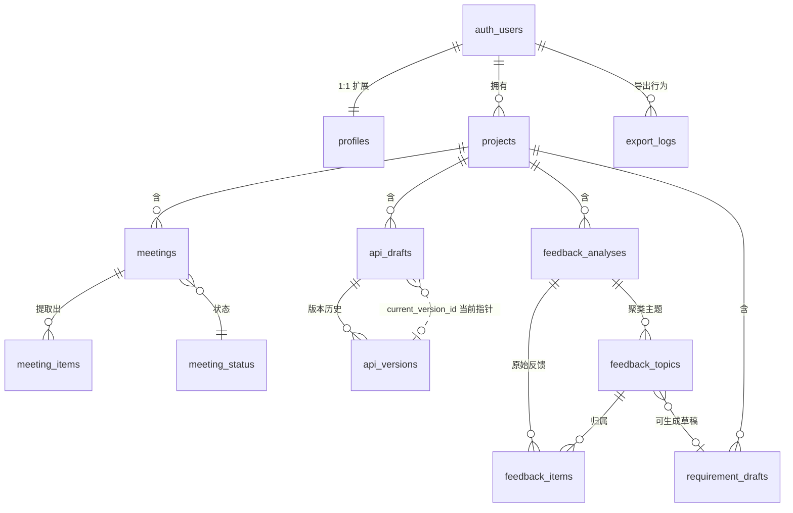

# RequirementBridge（需求桥）数据模型设计文档

| 项 | 内容 |
|---|---|
| 文档版本 | v1.1（CP0 决议回写：AI 服务 OpenAI → 通义千问；含 #1a 五处建表前修复） |
| 日期 | 2026-07-29 |
| 文档类型 | 数据库设计（DDL + ER + RLS + 索引 + 触发器） |
| 关联文档 | 《SOW 工作说明书》《需求拆解与排期文档》《需求说明清单》《设计评审清单 §6/§8》 |
| 技术底座 | Supabase Postgres（PG 15+），启用 RLS、pgjwt、uuid extension；AI 服务为**通义千问 DashScope** |
| 适用阶段 | 设计阶段产物，CP0 冻结基线 v1.0，开发前按本文建表 |

> **v1.1 变更摘要（CP0 决议回写）**：
> 1. `openai_usage jsonb` → **`llm_usage jsonb`**（中性命名），结构改为 `{asr:{...}, llm:{...}}`（§3.3/§3.5/§3.7）。
> 2. `meetings` 新增 **`asr_task_id text`**（Paraformer/fun-asr 异步任务 ID，断点续查）。
> 3. **#1a①**：`profiles.email` 加 **unique 约束**。
> 4. **#1a②**：修正 `fn_sync_topic_frequency`——跨主题 UPDATE 时**同时刷新 old + new**（原仅刷 new，导致旧主题计数虚高，违反"频次 100%"验收）。
> 5. **#1a③**（编辑联动扩展，F9 PM 口径）：`is_edited` 含 改/增/删 三类人工干预；触发规则——INSERT 仅 `is_manual=true` 触发、UPDATE 含列变更触发、DELETE 一律触发。
> 6. 状态机补**超时落 failed**（与接口契约 A2.3 联动）。

---

## 0. 设计原则与约定

1. **单用户 + 项目边界**：每条业务数据带 `user_id` + `project_id`；RLS 限定"仅本人可访问本人数据"（v1 不做团队协作）。
2. **UUID 主键**：统一 `gen_random_uuid()`，避免自增 ID 暴露规模与竞态。
3. **时间字段**：`created_at` / `updated_at` 统一 `timestamptz`（带时区）；`updated_at` 由触发器自动维护。
4. **状态机字段**：所有长任务用 `status` 枚举（uploading/transcribing/analyzing/completed/failed），与 SOW 性能要求一致。
5. **AI 用量留痕**：调用 AI 服务的表均带 `llm_usage jsonb`（中性命名，原 `openai_usage`，CP0 迁千问后改名），结构 `{asr:{...}, llm:{...}}`，支撑成本审计（需求清单 §7 成本可控、Q9）。
6. **编辑标记**：可被人工编辑的表带 `is_edited boolean`，支撑"未编辑率"指标（需求清单 §10）。
7. **软删除**：项目用 `archived_at`；其余数据先硬删（v1 量级小），v2 再引入 `deleted_at`。
8. **命名**：表名 `snake_case` 复数；外键 `<entity>_id`；布尔 `is_/has_`；枚举类型 `<entity>_<field>`。

---

## 1. ER 图（实体关系）



**关系基数说明**

| 关系 | 基数 | 说明 |
|---|---|---|
| users → projects | 1:N | 一个用户多个项目 |
| projects → meetings/api_drafts/feedback_analyses/requirement_drafts | 1:N | 项目隔离业务数据 |
| meetings → meeting_items | 1:N | 一次会议提取多条结构化条目 |
| api_drafts → api_versions | 1:N | 一个草稿多版本；`current_version_id` 指向当前 |
| feedback_analyses → feedback_items | 1:N | 原始反馈条目（支撑频次精确统计） |
| feedback_analyses → feedback_topics | 1:N | 聚类主题 |
| feedback_topics → feedback_items | 1:N | 主题包含哪些反馈（合并/删除时联动） |
| feedback_topics → requirement_drafts | 0:1 | 一个主题可生成一份需求草稿 |

---

## 2. 枚举类型（ENUM）

```sql
-- ============ 通用状态机（长任务） ============
create type task_status as enum (
  'uploading',    -- 上传中（音频/文件）
  'transcribing', -- 语音转写中（fun-asr/Paraformer，仅会议模块）
  'analyzing',    -- LLM 分析中（Qwen）
  'completed',    -- 完成
  'failed'        -- 失败
);

-- ============ 简化状态机（API/需求草稿，无转录环节） ============
create type gen_status as enum (
  'generating',
  'completed',
  'failed'
);

-- ============ 会议条目分类（需求清单 §4.1：决策/待办/需求/问题） ============
create type meeting_item_category as enum (
  'decision',    -- 决策
  'todo',        -- 待办
  'requirement', -- 需求
  'issue'        -- 遗留问题
);

-- ============ 优先级 ============
create type priority_level as enum (
  'high',
  'medium',
  'low'
);

-- ============ 情感（需求清单 §4.3：正/负/中） ============
create type sentiment_label as enum (
  'positive',
  'negative',
  'neutral'
);

-- ============ 输入方式 ============
create type input_mode as enum (
  'audio',  -- 会议：音频
  'text',   -- 会议：粘贴文本
  'paste',  -- 反馈：粘贴
  'file'    -- 反馈：上传文件
);

-- ============ 导出格式与模块 ============
create type export_format as enum ('md', 'csv', 'yaml', 'json', 'png');
create type export_module as enum ('meeting', 'api', 'feedback', 'requirement');
```

---

## 3. DDL（建表语句）

### 3.1 profiles（用户扩展，1:1 关联 auth.users）

```sql
create table profiles (
  id           uuid primary key references auth.users(id) on delete cascade,
  email        text not null unique,   -- #1a① CP0：登录态强依赖 email 唯一
  display_name text,
  created_at   timestamptz not null default now(),
  updated_at   timestamptz not null default now()
);
comment on table profiles is '用户扩展信息，注册时由触发器自动创建';
```

### 3.2 projects（项目）

```sql
create table projects (
  id                uuid primary key default gen_random_uuid(),
  user_id           uuid not null references auth.users(id) on delete cascade,
  name              text not null,
  description       text,
  api_spec_context  text,            -- 模块二的默认 API 规范上下文（选填）
  archived_at       timestamptz,     -- 软删除/归档
  created_at        timestamptz not null default now(),
  updated_at        timestamptz not null default now()
);
comment on column projects.api_spec_context is '项目级默认 API 规范上下文，模块二可复用';
```

### 3.3 meetings（会议主表）—— 模块一

```sql
create table meetings (
  id                uuid primary key default gen_random_uuid(),
  user_id           uuid not null references auth.users(id) on delete cascade,
  project_id        uuid not null references projects(id) on delete cascade,
  title             text not null,
  input_mode        input_mode not null,            -- audio / text
  -- 音频相关（仅 input_mode=audio 时有值）
  audio_path        text,                           -- Storage 路径（如 meeting-audio/<user>/<id>.mp3）
  audio_filename    text,
  audio_size_bytes  integer,
  asr_task_id       text,                           -- CP0：Paraformer/fun-asr 异步任务 ID（提交转写任务后回写，支持断点续查）
  -- 文本/转录
  raw_text          text,                           -- 粘贴文本 或 fun-asr/Paraformer 转录结果
  summary           text,                           -- Qwen 整体摘要
  -- 状态与错误
  status            task_status not null default 'uploading',
  error_message     text,
  -- 元数据
  is_edited         boolean not null default false, -- 任一条目被编辑/新增/删除则置 true（见 §6.4 扩展规则）
  llm_usage         jsonb,                          -- CP0：{asr:{...}, llm:{...}} 用量/费用（原 openai_usage）
  completed_at      timestamptz,
  created_at        timestamptz not null default now(),
  updated_at        timestamptz not null default now(),
  constraint meetings_size_limit check (
    audio_size_bytes is null or audio_size_bytes <= 52428800  -- 50MB（需求清单 §4.1）
  )
);
comment on table meetings is '模块一·会议主表，承载转录与结构化的状态流转';
```

### 3.4 meeting_items（会议结构化条目）—— 模块一

```sql
create table meeting_items (
  id           uuid primary key default gen_random_uuid(),
  meeting_id   uuid not null references meetings(id) on delete cascade,
  user_id      uuid not null references auth.users(id) on delete cascade,
  category     meeting_item_category not null,      -- decision/todo/requirement/issue
  content      text not null,                       -- 条目内容
  assignee     text,                                -- 负责人（缺失则前端标"待分配"）
  priority     priority_level not null default 'medium',
  quote        text,                                -- 原文引用（需求清单 §4.1）
  quote_offset integer,                             -- 引用在 transcript 中的字符偏移（程序化追溯）
  is_edited    boolean not null default false,      -- 改过则 true（支撑"未编辑率"指标）
  is_manual    boolean not null default false,      -- 用户手动新增的条目
  created_at   timestamptz not null default now(),
  updated_at   timestamptz not null default now()
);
comment on column meeting_items.quote_offset is '原文引用在转录文本中的字符偏移，用于程序化校验引用可追溯率（验收门槛 ≥90%）';
```

### 3.5 api_drafts（API 草稿）—— 模块二

```sql
create table api_drafts (
  id                  uuid primary key default gen_random_uuid(),
  user_id             uuid not null references auth.users(id) on delete cascade,
  project_id          uuid not null references projects(id) on delete cascade,
  title               text not null,
  business_requirement text not null,                -- 必填（需求清单 §4.2）
  api_spec_context    text,                          -- 选填，缺省时取 projects.api_spec_context
  current_yaml        text,                          -- 当前展示的 YAML（最新生成或编辑结果）
  current_version_id  uuid,                          -- 指向 api_versions.id（见 §3.6，建表后加 FK）
  status              gen_status not null default 'generating',
  error_message       text,
  is_edited           boolean not null default false,
  llm_usage           jsonb,                          -- CP0：{llm:{...}} 用量/费用（原 openai_usage）
  completed_at        timestamptz,
  created_at          timestamptz not null default now(),
  updated_at          timestamptz not null default now()
);
```

### 3.6 api_versions（API 版本历史）—— 模块二

```sql
create table api_versions (
  id             uuid primary key default gen_random_uuid(),
  draft_id       uuid not null references api_drafts(id) on delete cascade,
  user_id        uuid not null references auth.users(id) on delete cascade,
  version_number integer not null,                   -- 该草稿下自增序号
  yaml_content   text not null,
  is_auto        boolean not null default false,     -- true=自动保存 false=手动保存
  generated_at   timestamptz not null default now(),
  created_at     timestamptz not null default now(),
  unique (draft_id, version_number)
);

-- 自增序号：每条草稿的版本号递增（部分唯一索引 + CTE 实现于应用层或触发器）
-- 当前指针外键（api_drafts 建表后再补）
alter table api_drafts
  add constraint api_drafts_current_version_fk
  foreign key (current_version_id) references api_versions(id) on delete set null;
```

### 3.7 feedback_analyses（反馈分析主表）—— 模块三

```sql
create table feedback_analyses (
  id              uuid primary key default gen_random_uuid(),
  user_id         uuid not null references auth.users(id) on delete cascade,
  project_id      uuid not null references projects(id) on delete cascade,
  title           text not null,
  input_mode      input_mode not null,               -- paste / file
  source_filename text,                              -- 上传文件名（file 模式）
  feedback_column text,                              -- CSV 指定的反馈列名（需求清单 §4.3）
  total_count     integer not null default 0,        -- 反馈总条数（统计卡用）
  status          task_status not null default 'uploading',
  error_message   text,
  llm_usage       jsonb,                             -- CP0：{llm:{...}} 用量/费用（原 openai_usage）
  completed_at    timestamptz,
  created_at      timestamptz not null default now(),
  updated_at      timestamptz not null default now()
);
```

### 3.8 feedback_items（原始反馈条目）—— 模块三

```sql
create table feedback_items (
  id           uuid primary key default gen_random_uuid(),
  analysis_id  uuid not null references feedback_analyses(id) on delete cascade,
  user_id      uuid not null references auth.users(id) on delete cascade,
  content      text not null,
  topic_id     uuid references feedback_topics(id) on delete set null,  -- 见 §3.9
  sentiment    sentiment_label,                     -- 单条情感（聚类后回填）
  created_at   timestamptz not null default now()
);
comment on table feedback_items is '保留原始反馈，支撑频次精确统计（验收门槛 100%）与主题合并/删除联动';
```

### 3.9 feedback_topics（聚类主题）—— 模块三

```sql
create table feedback_topics (
  id              uuid primary key default gen_random_uuid(),
  analysis_id     uuid not null references feedback_analyses(id) on delete cascade,
  user_id         uuid not null references auth.users(id) on delete cascade,
  name            text not null,                     -- 主题命名
  summary         text,                              -- 主题摘要
  frequency       integer not null default 0,        -- 频次（= 关联 feedback_items 数）
  sentiment       sentiment_label,                   -- 主题整体情感
  priority        priority_level not null default 'medium',  -- 优先级建议
  sample_feedback jsonb,                             -- ["样本1","样本2","样本3"] 2-3 条
  is_edited       boolean not null default false,
  sort_order      integer not null default 0,        -- 按 frequency 降序时由应用层写入
  created_at      timestamptz not null default now(),
  updated_at      timestamptz not null default now()
);
comment on column feedback_topics.frequency is '频次需与 feedback_items.topic_id 计数严格一致（验收门槛 100%）；合并/删除时触发器或应用层同步刷新';
```

> 注：`feedback_items.topic_id` 与 `feedback_topics` 循环依赖，实际迁移时先建 `feedback_topics`（不带反向引用），再建 `feedback_items`，二者均已满足此顺序。

### 3.10 requirement_drafts（需求草稿，反馈回灌）—— 模块三衍生

```sql
create table requirement_drafts (
  id              uuid primary key default gen_random_uuid(),
  user_id         uuid not null references auth.users(id) on delete cascade,
  project_id      uuid not null references projects(id) on delete cascade,
  source_type     text not null default 'manual',    -- feedback_topic / manual
  source_topic_id uuid references feedback_topics(id) on delete set null,
  title           text not null,
  content         text not null,
  status          gen_status not null default 'completed',
  is_edited       boolean not null default false,
  created_at      timestamptz not null default now(),
  updated_at      timestamptz not null default now()
);
comment on table requirement_drafts is '由反馈主题生成的需求草稿，PM 校对后可手动带入 API 设计器（不自动串联，符合 v1 边界）';
```

### 3.11 export_logs（导出行为留痕）—— 横切

```sql
create table export_logs (
  id          uuid primary key default gen_random_uuid(),
  user_id     uuid not null references auth.users(id) on delete cascade,
  module      export_module not null,
  source_id   uuid not null,                         -- meetings/api_drafts/feedback_analyses/requirement_drafts.id
  format      export_format not null,
  created_at  timestamptz not null default now()
);
comment on table export_logs is '记录导出行为，支撑"导出外溢"指标与成本分析';
```

---

## 4. 索引（按查询模式）

```sql
-- profiles（#1a① email 已是 unique，自动建唯一索引，无需额外普通索引）

-- projects
create index idx_projects_user on projects(user_id) where archived_at is null;

-- meetings（最常见：按项目列会议、按状态查在途任务、按 asr_task_id 断点续查）
create index idx_meetings_project on meetings(project_id, created_at desc);
create index idx_meetings_user_status on meetings(user_id, status) where status in ('uploading','transcribing','analyzing');
create index idx_meetings_project_status on meetings(project_id, status);
create index idx_meetings_asr_task on meetings(asr_task_id) where asr_task_id is not null; -- CP0：Paraformer 任务续查

-- meeting_items（按会议查条目、按分类分组）
create index idx_items_meeting on meeting_items(meeting_id, category);
create index idx_items_user on meeting_items(user_id);

-- api_drafts / api_versions
create index idx_api_drafts_project on api_drafts(project_id, created_at desc);
create index idx_api_versions_draft on api_versions(draft_id, version_number desc);

-- feedback_*
create index idx_feedback_analyses_project on feedback_analyses(project_id, created_at desc);
create index idx_feedback_items_analysis on feedback_items(analysis_id);
create index idx_feedback_items_topic on feedback_items(topic_id);
create index idx_feedback_topics_analysis_freq on feedback_topics(analysis_id, frequency desc);

-- requirement_drafts
create index idx_requirement_drafts_project on requirement_drafts(project_id, created_at desc);

-- export_logs
create index idx_export_logs_user_time on export_logs(user_id, created_at desc);
```

---

## 5. RLS 策略（核心：单用户隔离）

> **原则**：所有业务表启用 RLS，策略统一为 `user_id = auth.uid()`。`auth.users` 与 `profiles` 无需 RLS（profiles 由触发器限定本人）。

```sql
-- ============ 开启 RLS ============
alter table projects             enable row level security;
alter table meetings             enable row level security;
alter table meeting_items        enable row level security;
alter table api_drafts           enable row level security;
alter table api_versions         enable row level security;
alter table feedback_analyses    enable row level security;
alter table feedback_items       enable row level security;
alter table feedback_topics      enable row level security;
alter table requirement_drafts   enable row level security;
alter table export_logs          enable row level security;

-- ============ 通用策略模板（每表四条：select/insert/update/delete） ============
-- 以 projects 为例，其余表同理（将 <table> 替换即可）

-- projects
create policy "projects_select_own" on projects
  for select using (user_id = auth.uid());
create policy "projects_insert_own" on projects
  for insert with check (user_id = auth.uid());
create policy "projects_update_own" on projects
  for update using (user_id = auth.uid()) with check (user_id = auth.uid());
create policy "projects_delete_own" on projects
  for delete using (user_id = auth.uid());

-- meetings
create policy "meetings_select_own" on meetings for select using (user_id = auth.uid());
create policy "meetings_insert_own" on meetings for insert with check (user_id = auth.uid());
create policy "meetings_update_own" on meetings for update using (user_id = auth.uid()) with check (user_id = auth.uid());
create policy "meetings_delete_own" on meetings for delete using (user_id = auth.uid());

-- meeting_items
create policy "items_select_own" on meeting_items for select using (user_id = auth.uid());
create policy "items_insert_own" on meeting_items for insert with check (user_id = auth.uid());
create policy "items_update_own" on meeting_items for update using (user_id = auth.uid()) with check (user_id = auth.uid());
create policy "items_delete_own" on meeting_items for delete using (user_id = auth.uid());

-- api_drafts
create policy "api_drafts_select_own" on api_drafts for select using (user_id = auth.uid());
create policy "api_drafts_insert_own" on api_drafts for insert with check (user_id = auth.uid());
create policy "api_drafts_update_own" on api_drafts for update using (user_id = auth.uid()) with check (user_id = auth.uid());
create policy "api_drafts_delete_own" on api_drafts for delete using (user_id = auth.uid());

-- api_versions
create policy "api_versions_select_own" on api_versions for select using (user_id = auth.uid());
create policy "api_versions_insert_own" on api_versions for insert with check (user_id = auth.uid());
create policy "api_versions_update_own" on api_versions for update using (user_id = auth.uid()) with check (user_id = auth.uid());
create policy "api_versions_delete_own" on api_versions for delete using (user_id = auth.uid());

-- feedback_analyses
create policy "fb_analyses_select_own" on feedback_analyses for select using (user_id = auth.uid());
create policy "fb_analyses_insert_own" on feedback_analyses for insert with check (user_id = auth.uid());
create policy "fb_analyses_update_own" on feedback_analyses for update using (user_id = auth.uid()) with check (user_id = auth.uid());
create policy "fb_analyses_delete_own" on feedback_analyses for delete using (user_id = auth.uid());

-- feedback_items
create policy "fb_items_select_own" on feedback_items for select using (user_id = auth.uid());
create policy "fb_items_insert_own" on feedback_items for insert with check (user_id = auth.uid());
create policy "fb_items_update_own" on feedback_items for update using (user_id = auth.uid()) with check (user_id = auth.uid());
create policy "fb_items_delete_own" on feedback_items for delete using (user_id = auth.uid());

-- feedback_topics
create policy "fb_topics_select_own" on feedback_topics for select using (user_id = auth.uid());
create policy "fb_topics_insert_own" on feedback_topics for insert with check (user_id = auth.uid());
create policy "fb_topics_update_own" on feedback_topics for update using (user_id = auth.uid()) with check (user_id = auth.uid());
create policy "fb_topics_delete_own" on feedback_topics for delete using (user_id = auth.uid());

-- requirement_drafts
create policy "req_drafts_select_own" on requirement_drafts for select using (user_id = auth.uid());
create policy "req_drafts_insert_own" on requirement_drafts for insert with check (user_id = auth.uid());
create policy "req_drafts_update_own" on requirement_drafts for update using (user_id = auth.uid()) with check (user_id = auth.uid());
create policy "req_drafts_delete_own" on requirement_drafts for delete using (user_id = auth.uid());

-- export_logs（仅 insert + select，不更新不删）
create policy "export_select_own" on export_logs for select using (user_id = auth.uid());
create policy "export_insert_own" on export_logs for insert with check (user_id = auth.uid());
```

> **验证要点**（Day 2 验收）：用 A/B 两个测试账号互查对方 `project_id` 数据，必须返回 0 行。

---

## 6. 触发器与函数

### 6.1 updated_at 自动维护

```sql
create or replace function fn_set_updated_at()
returns trigger language plpgsql as $$
begin
  new.updated_at = now();
  return new;
end; $$;

-- 对所有含 updated_at 的表挂触发器
create trigger trg_profiles_updated     before update on profiles           for each row execute function fn_set_updated_at();
create trigger trg_projects_updated     before update on projects           for each row execute function fn_set_updated_at();
create trigger trg_meetings_updated     before update on meetings           for each row execute function fn_set_updated_at();
create trigger trg_items_updated        before update on meeting_items      for each row execute function fn_set_updated_at();
create trigger trg_api_drafts_updated   before update on api_drafts         for each row execute function fn_set_updated_at();
create trigger trg_fb_analyses_updated  before update on feedback_analyses  for each row execute function fn_set_updated_at();
create trigger trg_fb_topics_updated    before update on feedback_topics    for each row execute function fn_set_updated_at();
create trigger trg_req_drafts_updated   before update on requirement_drafts for each row execute function fn_set_updated_at();
```

### 6.2 注册时自动建 profile

```sql
create or replace function fn_handle_new_user()
returns trigger language plpgsql security definer set search_path = public as $$
begin
  insert into profiles (id, email, display_name)
  values (new.id, new.email, coalesce(new.raw_user_meta_data->>'display_name', split_part(new.email,'@',1)));
  return new;
end; $$;

create trigger trg_on_auth_user_created
  after insert on auth.users
  for each row execute function fn_handle_new_user();
```

### 6.3 频次一致性触发器（feedback_topics.frequency ↔ feedback_items 计数）

> 保障验收门槛"频次统计准确率 100%"——`frequency` 始终等于 `count(feedback_items where topic_id = ?)`。
>
> **#1a② CP0 修复**：原实现 `coalesce(new.topic_id, old.topic_id)` 在 **UPDATE 把 item 从主题 A 移到主题 B** 时只刷了 NEW 主题 B，**未刷 OLD 主题 A**（A 计数虚高，直接违反"频次 100%"验收）。修复后：INSERT→刷 new；UPDATE→同时刷 old（若变化）和 new；DELETE→刷 old。

```sql
-- #1a② 修复版：跨主题移动时同时刷新 old + new 两个主题
create or replace function fn_sync_topic_frequency()
returns trigger language plpgsql as $$
declare
  old_topic uuid := case when (tg_op = 'UPDATE' or tg_op = 'DELETE') then old.topic_id else null end;
  new_topic uuid := case when (tg_op = 'UPDATE' or tg_op = 'INSERT') then new.topic_id else null end;
begin
  -- INSERT：刷 new_topic
  -- UPDATE：若 topic_id 变化，刷 old_topic 和 new_topic；未变化也刷 new_topic（计数不变，幂等）
  -- DELETE：刷 old_topic
  if old_topic is not null and old_topic is distinct from new_topic then
    update feedback_topics
       set frequency = (select count(*) from feedback_items where topic_id = old_topic)
     where id = old_topic;
  end if;
  if new_topic is not null then
    update feedback_topics
       set frequency = (select count(*) from feedback_items where topic_id = new_topic)
     where id = new_topic;
  end if;
  return coalesce(new, old);
end; $$;

create trigger trg_sync_topic_freq
  after insert or update of topic_id or delete
  on feedback_items
  for each row execute function fn_sync_topic_frequency();
```

> **回归用例（F8，建表时固化）**：①主题 A 有 2 条、B 有 3 条；把 A 的 1 条移到 B → A 应为 1、B 应为 4（验证同时刷新）；②删除 B 的 1 条 → B 应为 3；③RLS A/B 账号互查返回 0 行。
```

### 6.4 编辑标记联动（meeting_items 改/增/删 → meeting.is_edited）

> **#1a③ CP0 + F9 PM 口径**：`is_edited` 含 **改/增/删** 三类人工干预（理由：支撑"AI 采纳率/未编辑率"验收的诚实性——用户增/删条目同样意味着"AI 原始输出未被原样采纳"）。触发规则：
> - **INSERT**：仅 `is_manual=true` 触发（AI 批量写入 `is_manual=false` 不触发，否则分析完即自标 edited）。
> - **UPDATE**：`content/assignee/priority/category` 任一列变更即触发。
> - **DELETE**：一律触发。

```sql
create or replace function fn_mark_meeting_edited()
returns trigger language plpgsql as $$
declare
  m_id uuid;
begin
  -- UPDATE/INSERT 取 new.meeting_id；DELETE 取 old.meeting_id
  m_id := coalesce(new.meeting_id, old.meeting_id);
  if m_id is not null then
    update meetings set is_edited = true where id = m_id;
  end if;
  return coalesce(new, old);
end; $$;

-- UPDATE：任一关键列变更
create trigger trg_mark_meeting_edited_update
  after update of content, assignee, priority, category on meeting_items
  for each row execute function fn_mark_meeting_edited();

-- INSERT：仅手动新增触发（AI 批量写入 is_manual=false 不触发）
create trigger trg_mark_meeting_edited_insert
  after insert on meeting_items
  for each row when (new.is_manual = true)
  execute function fn_mark_meeting_edited();

-- DELETE：一律触发
create trigger trg_mark_meeting_edited_delete
  after delete on meeting_items
  for each row execute function fn_mark_meeting_edited();
```
```

---

## 7. Storage Buckets（Supabase Storage）

```sql
-- 会议音频 bucket（私有，RLS 限定本人）
insert into storage.buckets (id, name, public) values ('meeting-audio','meeting-audio', false);

-- 反馈文件 bucket
insert into storage.buckets (id, name, public) values ('feedback-files','feedback-files', false);

-- Storage 策略：仅本人读写本人目录（约定路径：<bucket>/<user_id>/<file>）
create policy "audio_own_rw" on storage.objects
  for all using (bucket_id in ('meeting-audio','feedback-files')
                 and (storage.foldername(name))[1] = auth.uid()::text)
  with check (bucket_id in ('meeting-audio','feedback-files')
              and (storage.foldername(name))[1] = auth.uid()::text);
```

> **路径约定**：`meeting-audio/<user_id>/<meeting_id>.mp3`，确保 Storage 策略可按目录隔离。

---

## 8. 字段 → 验收指标映射

> 本节证明数据模型直接支撑 SOW §6.2 的准确度验收门槛。

| 验收指标（SOW §6.2） | 支撑字段 | 程序化校验方式 |
|---|---|---|
| 结构化分类准确率 ≥80% | `meeting_items.category` | 评测集对比 |
| 负责人/优先级命中率 ≥70% | `meeting_items.assignee/priority` | 评测集抽检 |
| **原文引用可追溯率 ≥90%** | `meeting_items.quote` + `quote_offset` + `meetings.raw_text` | 字符串包含校验 |
| 转录可读性 | `meetings.raw_text` | 人工抽检 |
| **OpenAPI 合法率 100%** | `api_drafts.current_yaml` | Swagger Parser 校验 |
| **字段命名规范率 ≥95%** | `api_drafts.current_yaml` | 程序化扫描 camelCase |
| **错误码完整率 100%** | `api_drafts.current_yaml` | 校验含 400/401/404/500 |
| 语义相关度 | `api_drafts.business_requirement` + `current_yaml` | 人工抽检 |
| 聚类合理度 | `feedback_topics` + `feedback_items.topic_id` | 人工抽检 |
| **频次统计准确率 100%** | `feedback_topics.frequency` ↔ `feedback_items` 计数 | 触发器 + 计数核对 |
| 情感分类一致率 ≥75% | `feedback_topics.sentiment` / `feedback_items.sentiment` | 评测集抽检 |
| 样本代表性 ≥90% | `feedback_topics.sample_feedback` | 人工抽检 |

---

## 9. 迁移与初始化顺序

> 因外键与循环引用，迁移须严格按以下顺序执行（建议拆为 `001_enums.sql` → `002_tables.sql` → `003_indexes.sql` → `004_rls.sql` → `005_triggers.sql` → `006_storage.sql`）。
>
> **CP0 提示**：本文档为 v1.1，已含 #1a 五处修复——T0.2 生成迁移 SQL 时**直接采用本文 DDL**，无需再改。

1. **创建 extension**：`create extension if not exists "uuid-ossp";`（Supabase 默认已装 pgcrypto，`gen_random_uuid()` 可用）
2. **建枚举**（§2）
3. **建表顺序**（处理循环依赖）：
   - `profiles`（email 已含 unique）→ `projects`
   - `meetings`（含 `asr_task_id`、`llm_usage`）→ `meeting_items`
   - `feedback_topics`（先建，不带反向引用）→ `feedback_items`（带 `topic_id`）
   - `api_drafts`（先不带 `current_version_id` 的 FK）→ `api_versions` → `alter api_drafts add constraint`（§3.6）
   - `requirement_drafts` → `export_logs`
4. **建索引**（§4）
5. **开 RLS + 策略**（§5）
6. **建触发器/函数**（§6，**含 #1a② 修复版频次函数 + #1a③ 扩展编辑联动**）
7. **建 Storage buckets + 策略**（§7）

> **循环依赖说明**：`feedback_topics` 与 `feedback_items` 互相引用——实际通过先建 `feedback_topics`、再建 `feedback_items.topic_id` 解决，无真正循环（`topics` 不反向引用 `items`）。`api_drafts ↔ api_versions` 同理用 `alter add constraint` 后置。

---

## 10. 待确认问题（数据模型相关）—— CP0 已全部决议

> 原 DM-1~DM-4 经 CP0 评审（2026-07-29）已全部形成决议，不再是"待确认"。

| # | 问题 | CP0 决议（2026-07-29） | 状态 |
|---|---|---|---|
| DM-1 | Q10：RLS"仅本人"是否影响团队协作？预留 `org_members`？ | **v1 不预留**，未来加表迁移（D1 后半） | ✅ 已决议 |
| DM-2 | Q5：反馈是否需增量分析？ | **v1 一次性分析**，不加 `parent_analysis_id`（D4） | ✅ 已决议 |
| DM-3 | Q9：AI 用量上限/熔断？ | **本期不做看板**；`llm_usage jsonb`（已改名）留痕 + Edge Function 重试 1 次/落 failed（C1） | ✅ 已决议 |
| DM-4 | Q1：数据合规——音频/反馈送 AI 是否需脱敏？ | **迁通义千问 DashScope（国内不出境）即满足 v1 基线**；v1 加上传前提示 + 敏感字段建议（不强脱敏）；保留期随业务数据可删；企业版区域隔离留 v2（B8） | ✅ 已决议（阻断解除） |
| DM-5（新） | AI 服务选型对数据模型的影响 | OpenAI→**通义千问**：`openai_usage`→`llm_usage`、加 `asr_task_id`（B1-B3） | ✅ 已落地（本文 v1.1） |
| DM-6（新） | 频次触发器跨主题 BUG | **#1a② 已修复**：UPDATE 同时刷 old+new（§6.3） | ✅ 已修复 |
| DM-7（新） | 编辑联动口径 | **#1a③ 含改/增/删**：INSERT 仅 is_manual 触发/UPDATE 列变更触发/DELETE 触发（§6.4） | ✅ 已落地 |
