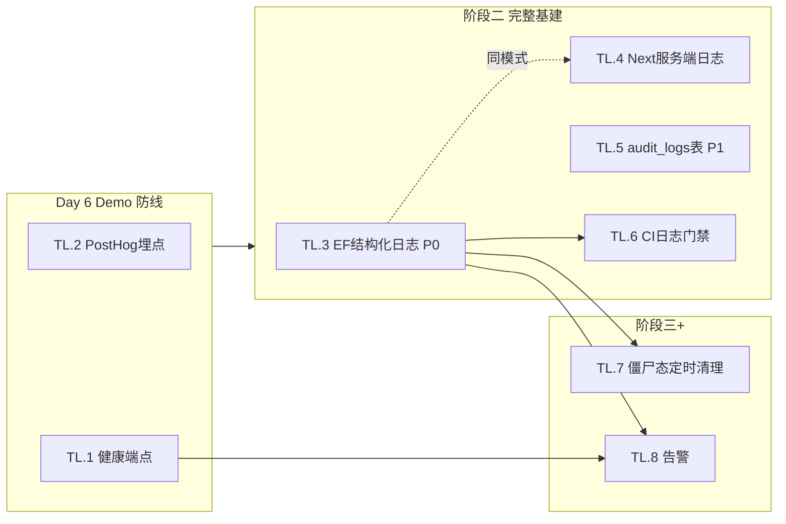

# 需求桥（RequirementBridge）日志与审计基础设施开发计划

| 项 | 内容 |
|---|---|
| 文档版本 | v1.0 |
| 日期 | 2026-07-31（Day 5） |
| 文档类型 | 专项开发计划（WBS + 排期 + DoD），嵌套于既有排期体系 |
| 编制背景 | 补齐《系统接入说明与数据流图 §7》识别的日志/审计 Gap |
| 关联文档 | 《系统接入说明与数据流图》《需求拆解与排期文档 v1.1》《开发工作流规范》《数据模型设计文档》 |
| 决策口径 | **时间窗口：混合（Day 6 做 Demo 必需项 + 阶段二做完整基础设施）**；**范围：应用层优先（audit_logs 表 + 结构化日志 + PostHog 埋点）**，告警与定时清理后置 |

> **阅读须知**：本计划是既有排期文档的**增量**，不另起炉灶。任务编号用 `TL.*`（Telemetry/Logging）前缀，与既有 `T4.*`（M4 横切）解耦但协同。落地节奏严格遵循用户决策：**Day 6 只做 Demo 裸奔防线，阶段二做完整基建**。

---

## 0. 编制依据（现状校准，非排期文档的旧假设）

> 排期文档 v1.1 写于 Day 2，**与 Day 5 真实进度有偏差**。本计划基于代码实测（commit `95b7747` + 工作区未提交文件），校准如下：

| 模块 | 排期文档假设 | Day 5 真实进度（实测） | 对本计划的影响 |
|---|---|---|---|
| M1 会议 | Day 3-4 | ✅ 已完成并提交（`b9cf713`，T1.1-T1.6 全） | 已结束，不占用时间 |
| M2 API | Day 4-5 核心，Day 5 收尾 | ✅ 核心已提交（`95b7747`，T2.1-T2.3） | 核心已结束，Day 5 余量释放 |
| M3 反馈 | Day 5 核心才开始 | ⚠️ 核心代码已写完**但未提交**（lib 244行 + 58 测试 + EF 210行 + 端到端写库） | Day 5 首要动作：提交 M3，再谈日志 |
| M4 埋点 T4.2 | Day 6 | ❌ 代码 grep 为空，未落地 | 本计划 TL.3 接管此任务 |
| 系统/审计日志 | 未在排期 | ❌ 完全缺失 | 本计划新增 |

**结论**：真实进度比排期文档**快约半天到一天**。Day 5 可挤出 ~0.5 PD 给日志基建预热，Day 6 在保证 Demo 前提下可挤 ~0.5 PD。但按用户决策，**Day 6 只做"Demo 不裸奔"的最小可观测**，完整基建进阶段二。

---

## 1. 目标与非目标

### 1.1 目标（本计划覆盖）

| # | 目标 | 对应 §7.5 建议 | 落地阶段 |
|---|---|---|---|
| G1 | Edge Function 结构化日志（JSON line，可被平台采集） | P0 | 阶段二 |
| G2 | `audit_logs` 表 + 触发器自动记录改/增/删/导出 | P1 | 阶段二 |
| G3 | 正式健康检查端点（替代一次性 B5） | P1 | Day 6（Demo 前必须有） |
| G4 | PostHog 埋点（接管原 T4.2） | P1→Day6 | Day 6（Demo 证据） |
| G5 | 超时僵尸态定时清理（A2.3 补实现） | P2 | 后置（阶段三+） |
| G6 | 告警（失败率/延迟阈值） | P2 | 后置（阶段四+） |

### 1.2 非目标（明确不做，避免范围蔓延）

- ❌ **ELK/Loki 自建日志聚合**：v1 用 Supabase 平台日志 + PostHog，不自建基础设施（成本与 5 天周期不匹配）。
- ❌ **全链路分布式追踪（OpenTelemetry）**：v1 单用户、Edge Function 链路短，ROI 不足。
- ❌ **实时审计大屏 / BI**：v1 只做"可查"，不做"可视化分析"。
- ❌ **日志驱动自动熔断**：DM-3 已决议 v1 不做看板/熔断，`llm_usage` 留痕即可。

---

## 2. 总体方案（三层可观测）

```
┌─────────────────────────────────────────────────────────────┐
│  第一层：结构化运行日志（G1）—— "系统在干什么"                │
│  · Edge Function 输出 JSON line（level/ts/ef/meetingId/...）  │
│  · Next.js 服务端走统一 logger（pino 或轻量封装）             │
│  · 落点：Supabase 平台日志（EF）+ Vercel Runtime Logs（Next） │
├─────────────────────────────────────────────────────────────┤
│  第二层：审计日志表（G2）—— "谁改了什么"                     │
│  · audit_logs 表（user_id/action/target/diff/at）             │
│  · 触发器自动写（改/增/删）；导出走应用层显式写               │
│  · 落点：Postgres（可 SQL 查询，RLS 限定本人）                │
├─────────────────────────────────────────────────────────────┤
│  第三层：业务埋点（G4）+ 健康探测（G3）—— "用得怎样/活着吗"   │
│  · PostHog：meeting_created/analysis_completed/item_edited... │
│  · GET /functions/v1/health：DB+Storage+DashScope 三项探活   │
│  · 落点：PostHog（产品分析）+ 冒烟/监控                       │
└─────────────────────────────────────────────────────────────┘
```

**为何分三层**：日志（运行时行为）、审计（数据变更谁做的）、埋点（产品使用）解决不同问题，混在一起会既查不了系统故障、也追溯不了人为操作。现有项目只有零散业务留痕（`error_message`/`is_edited`/`llm_usage`），三层都缺。

---

## 3. 任务拆解（WBS + DoD + 工时 + 截止）

> 列说明：`ID` | 任务 | 优先级 | 依赖 | 完成标准（DoD） | 工时(PD) | 截止 | 阶段
> 编号 `TL.*` = Telemetry/Logging，独立于 `T4.*` 但协同（TL.3 吸收 T4.2 的埋点职责）。

### 3.1 Day 6 专项（Demo 不裸奔防线，P1）

> 用户决策：Day 6 只做 Demo 必需的可观测项。这两项是"演示时能拿出运行证据"的底线。

| ID | 任务 | 优先级 | 依赖 | 完成标准（DoD） | 工时 | 截止 |
|---|---|---|---|---|---|---|
| **TL.1** | 正式健康检查端点 | P1 | — | 把 `b5-health-check` 改造为 `GET /functions/v1/health`：探测①Postgres（select 1）②Storage（bucket 存在）③DashScope（qwen-plus 1 token ping）；返回 `{status, checks:{db,storage,llm}, latencyMs}`；无鉴权（公开）；Demo 可直接 curl 展示"系统活着" | 0.3 | Day 6 |
| **TL.2** | PostHog 埋点 MVP（吸收 T4.2） | P1 | T0.3 | PostHog SDK 接入（`src/app/layout.tsx` + `src/lib/telemetry/posthog.ts`）；登录后 `identify(userId)`；3 类核心事件埋点：`meeting_created`/`analysis_completed`（含 module+status）/`item_edited`；key 走 `NEXT_PUBLIC_POSTHOG_KEY`（前端可见，合规）；本地可选关闭 | 0.5 | Day 6 |

**Day 6 时间预算**：原 Day 6 任务（T3.4-T3.6 收尾 + T5.1-T5.3 集成/评测/Demo）≈ 4.0 PD。TL.1+TL.2 ≈ 0.8 PD。**需从 Demo 打磨（T5.3，0.5PD）借 0.3PD，或利用 M3 已提前完成的余量**（见 §0 校准：M3 代码已写完，Day 6 收尾工时实际 < 排期）。可行。

### 3.2 阶段二（Day 7-10，完整基础设施，P0/P1）

> 用户决策：完整日志/审计表/结构化日志放阶段二。阶段二排期文档原目标为"补齐 P1 全量"，本计划把日志基建作为阶段二的**优先项**插入。

| ID | 任务 | 优先级 | 依赖 | 完成标准（DoD） | 工时 | 截止 |
|---|---|---|---|---|---|---|
| **TL.3** | Edge Function 结构化日志封装 | **P0** | — | 新建 `supabase/functions/_shared/logger.ts`：提供 `log.info/warn/error(event, fields)`，输出单行 JSON（`{ts,level,ef,event,meetingId\|draftId\|analysisId,userId,step,latencyMs,errorCode,...}`）；改造 4 个 EF（meeting-transcribe/extract、api-generate、feedback-analyze）关键步骤打点（入口/调AI前/调AI后/写库/异常）；替换现有 2 处裸 `console.*`；日志不含密钥/不含 raw_text 全文（只截前 100 字） | 0.8 | 阶段二 |
| **TL.4** | Next.js 服务端统一日志 | P1 | — | `src/lib/logger.ts`（轻量封装，非 pino，避免依赖膨胀）：Server Action 与 middleware 的关键路径（鉴权失败、Edge Function 触发失败、revalidate）输出结构化日志；与 EF 日志格式对齐（同一字段命名） | 0.4 | 阶段二 |
| **TL.5** | `audit_logs` 表 + 触发器 | **P1** | T0.2 | 新 migration `007_audit_logs.sql`：建 `audit_logs(id,user_id,action,table_name,target_id,before jsonb,after jsonb,at timestamptz)`；RLS（本人可查本人）；触发器挂 `meeting_items`/`feedback_topics`/`api_drafts` 的 UPDATE/DELETE（记录 before+after）；导出动作由应用层显式 insert（复用 `export_logs` 思路，或合并）；A/B 账号验证互查返回 0 行 | 0.8 | 阶段二 |
| **TL.6** | CI 日志格式门禁 | P1 | TL.3 | `.github/workflows/ci.yml` 加一道检查：扫描 EF 源码，确保无裸 `console.log/console.error`（必须走 `logger.*`）；单测覆盖 logger 的 JSON 输出格式（字段齐全、无密钥泄漏） | 0.3 | 阶段二 |

**阶段二小计**：2.3 PD。阶段二排期文档原周期 Day 7-10（约 1 周 / 5 PD），本组任务占 ~2.3 PD，余量给 P1 功能补全（版本管理/合并删除/响应式等），不冲突。

### 3.3 后置（阶段三+，P2）

| ID | 任务 | 优先级 | 依赖 | 完成标准（DoD） | 工时 | 截止 |
|---|---|---|---|---|---|---|
| **TL.7** | 超时僵尸态定时清理 | P2 | TL.3 | 用 Supabase pg_cron 或定时 EF：每 10 分钟扫 `meetings/feedback_analyses` 中 `status in (transcribing/analyzing) and updated_at < now()-interval '5 min'`，置 `failed` + `error_message='超时僵尸态自动回收'`；落地 A2.3 约定（接口契约已写但无实现） | 0.5 | 阶段三 |
| **TL.8** | 告警（失败率/延迟） | P2 | TL.1,TL.3 | 基于 health 端点 + 日志：失败率 > 阈值或 DashScope 延迟 > P95 时告警（v1 可降级为"PostHog insight + 人工巡检"，不做 PagerDuty 级） | 0.5 | 阶段四 |

---

## 4. 排期嵌入（与既有排期协同）

### 4.1 本 Sprint（Day 5-6）甘特增量

```
任务 \ 日期        Day5(今天)      Day6
                  07/31           08/01
                  周五             周六
─────────────────────────────────────────
M3 反馈           ████→提交        ▒▒收尾(T3.4-3.6)
                    ↑
                 首要：提交未提交的 M3 代码
M2 收尾                           ▒▒(T2.4-2.6 已部分)
M5 集成/评测/Demo                  ████(T5.1-5.3)
─────────────────────────────────────────
TL 日志/审计（本计划）
  TL.1 健康端点                   ░░ 0.3PD
  TL.2 PostHog埋点                ██ 0.5PD
  TL.3-6 完整基建                 （→阶段二）
─────────────────────────────────────────
里程碑                             ◆CP5 Demo达标
```

**Day 5 今天动作建议**（按优先级）：
1. **先提交 M3 未提交代码**（feedback lib/actions/EF/test）——这是当前工作区的债，不提交会阻塞 Day 6 集成（T5.1 依赖 M1+M2+M3 都可跑）。
2. M3 提交后，Day 5 余量可**预热 TL.3**：先把 `_shared/logger.ts` 封装写好（不接 EF），作为阶段二的"零件"提前备好，降低阶段二压力。这是可选的，不强制。

### 4.2 阶段二（Day 7-10）排期调整

排期文档 §6 阶段二原目标："补齐 P1 全量 + 修复 Demo 评审反馈"。本计划插入 TL.3-TL.6（2.3PD）后调整：

| 阶段二任务组 | 工时 | 说明 |
|---|---|---|
| **TL.3-TL.6 日志/审计基建（本计划）** | 2.3 PD | **阶段二优先项**（Demo 后系统已可跑，补可观测是最高 ROI） |
| 原 P1 功能补全（T2.5 版本管理/T3.5 草稿等） | ~2.0 PD | 视 Demo 评审反馈取舍 |
| Demo 评审反馈修复 | ~0.7 PD | 按反馈单 |

阶段二总计 ~5 PD，与原周期（Day 7-10，约 1 周）吻合。**若 Demo 评审反馈多，则 TL.4/TL.6（P1）可顺延，但 TL.3（P0 结构化日志）+ TL.5（P1 审计表）建议必做**——这是线上排障与合规留痕的底线。

---

## 5. 技术设计要点

### 5.1 Edge Function 结构化日志格式（TL.3）

```ts
// supabase/functions/_shared/logger.ts（新建）
export function log(
  level: "info" | "warn" | "error",
  event: string,
  fields: Record<string, unknown> = {}
) {
  const line = JSON.stringify({
    ts: new Date().toISOString(),
    level,
    ef: fields.ef ?? "unknown",          // edge function 名
    event,                                // "asr.submit" / "llm.extract.done" 等
    meetingId: fields.meetingId,          // 业务实体 ID（按场景填）
    userId: fields.userId,
    step: fields.step,
    latencyMs: fields.latencyMs,
    errorCode: fields.errorCode,
    // 安全：不输出密钥、不全量输出 raw_text
    snippet: fields.snippet,              // 文本前 100 字，便于排障又不泄漏全量
  });
  // Supabase 平台采集 stdout；Deno 的 console 默认走 stdout
  level === "error" ? console.error(line) : console.log(line);
}
```

**打点位置**（每个 EF 至少 4 点）：
1. 入口：`log("info", "ef.enter", {ef, meetingId})`
2. 调 AI 前：`log("info", "llm.call", {ef, step:"pre-llm"})`
3. 调 AI 后：`log("info", "llm.done", {ef, latencyMs, tokens})`（从现有 `dashscopeChat` 返回的 tokens 取）
4. 异常：`log("error", "ef.failed", {ef, errorCode, snippet: e.message.slice(0,100)})`

**为何不用 pino（EF 侧）**：Deno Edge Function 运行时轻量，自封装 ~30 行足够，避免引入 npm 依赖的打包复杂度。Next.js 侧（TL.4）同理用轻量封装。

### 5.2 `audit_logs` 表设计（TL.5）

```sql
-- 007_audit_logs.sql（新建 migration，只增不改既有）
create table audit_logs (
  id          uuid primary key default gen_random_uuid(),
  user_id     uuid not null references auth.users(id) on delete cascade,
  action      text not null,          -- update / delete / export
  table_name  text not null,          -- meeting_items / feedback_topics / ...
  target_id   uuid not null,
  before      jsonb,                  -- 变更前快照（UPDATE/DELETE）
  after       jsonb,                  -- 变更后快照（UPDATE）
  at          timestamptz not null default now()
);
create index idx_audit_user_time on audit_logs(user_id, at desc);
create index idx_audit_target on audit_logs(table_name, target_id);

alter table audit_logs enable row level security;
create policy "audit_select_own" on audit_logs for select using (user_id = auth.uid());

-- 触发器示例：meeting_items 改动落审计
create or replace function fn_audit_meeting_items()
returns trigger language plpgsql as $$
begin
  insert into audit_logs (user_id, action, table_name, target_id, before, after)
  values (
    coalesce(new.user_id, old.user_id),
    tg_op::text, 'meeting_items',
    coalesce(new.id, old.id),
    case when tg_op='DELETE' then to_jsonb(old) else null end,
    case when tg_op='UPDATE' then to_jsonb(new) else null end
  );
  return coalesce(new, old);
end; $$;
create trigger trg_audit_meeting_items_update
  after update on meeting_items for each row execute function fn_audit_meeting_items();
create trigger trg_audit_meeting_items_delete
  after delete on meeting_items for each row execute function fn_audit_meeting_items();
-- feedback_topics / api_drafts 同理（DoD 要求）
```

**与现有 `export_logs` 的关系**：`export_logs` 只记导出（轻量），`audit_logs` 记数据变更（重量）。二者并存，不合并（职责不同）。导出是否也写 `audit_logs`？TL.5 的 DoD 写"导出走应用层显式 insert"，可选合并到 `export_logs` 或双写，实现时定。

### 5.3 健康端点（TL.1）

复用现有 `b5-health-check` 的连通测试逻辑，改为三探活：

```ts
// GET /functions/v1/health（无鉴权）
// checks: { db: select 1, storage: bucket 存在, llm: qwen-plus 1 token }
// 响应：{ status: "ok"|"degraded", checks: {...}, latencyMs: {...}, ts }
```

与 B5 的区别：B5 是一次性连通验证（临时），health 是**常驻公开端点**，供 Demo curl + 未来监控调用。

### 5.4 PostHog 埋点（TL.2）

```ts
// src/lib/telemetry/posthog.ts（新建）
// key: NEXT_PUBLIC_POSTHOG_KEY（前端可见，PostHog 设计如此，合规）
// 事件：meeting_created / analysis_completed / item_edited
//       api_generation_completed / topic_merged / requirement_draft_generated
```

复用排期文档 T4.2 已定义的事件清单，本计划只补"代码落地"（排期有规划无代码）。

---

## 6. 验收与门禁

### 6.1 任务级 DoD 汇总（逐条可验收）

| 任务 | DoD 核验方式 |
|---|---|
| TL.1 | `curl /functions/v1/health` 返回三 checks + status；Demo 现场可演示 |
| TL.2 | 触发 meeting_created 后，PostHog（或本地 console 降级）可见事件；登录后 identify 生效 |
| TL.3 | grep EF 源码无裸 `console.*`；触发一次会议提取，Supabase 日志见 4 条 JSON line（字段齐全、无密钥、snippet ≤100 字） |
| TL.4 | Server Action 鉴权失败/触发 EF 失败时，Vercel Runtime Logs 见结构化日志 |
| TL.5 | 编辑一条 meeting_item 后，`select * from audit_logs` 见记录（含 before/after）；A/B 账号互查返回 0 行 |
| TL.6 | CI 新门禁：扫到裸 console.* 则失败；logger 单测通过 |
| TL.7 | 构造一个 updated_at=10 分钟前的 transcribing 记录，等定时任务跑后变 failed |
| TL.8 | 人为制造高失败率，告警触发（或 PostHog insight 可见） |

### 6.2 门禁嵌入

- TL.6 的 CI 门禁**必须在 TL.3 之后上线**，否则会误报现有 2 处裸 `console.*`。
- TL.5 的 migration（`007_audit_logs.sql`）遵循《开发工作流规范 §3.6》：只增不改、走 PR、RLS 改动双人 CR。
- 所有 TL.* 任务进 CR 时，检查清单加一条："日志/审计是否记录了敏感数据（密钥/raw_text 全文）"。

---

## 7. 风险与对策

| 风险 | 对策 |
|---|---|
| Day 6 时间被 Demo 集成挤占，TL.1/TL.2 做不完 | 优先级：**TL.2(PostHog) > TL.1(health)**。埋点是 Demo 证据必需（Sprint 级 DoD §5.3 明确要求"埋点就位"）；health 端点可降级为 Demo 时手动 curl B5 临时端点。若实在来不及，TL.1 顺延阶段二，TL.2 必保。 |
| TL.3 改造 4 个 EF 引入回归 | 每个 EF 改造独立 PR + 跑对应模块评测（AI 链路改动必跑评测，见工作流 §4.3）；先改 meeting-extract（已有测试覆盖）验证模式，再推广 |
| `audit_logs` 触发器影响写性能 | v1 单用户量级小，触发器开销可忽略；加索引（§5.2）保障查询；若阶段三量级上来再优化 |
| 结构化日志泄漏敏感数据 | logger 封装层强制：无密钥字段、raw_text 只进 snippet（前 100 字）；CR 专项检查 |
| PostHog key 前端可见被诟病 | PostHog 设计即为前端可见 key（靠其自身权限模型），非敏感；文档说明合规依据（§5.4） |

---

## 8. 落地顺序与依赖图



**关键路径**：TL.3（结构化日志）是基建核心，TL.6（CI 门禁）依赖它，TL.7（定时清理）和 TL.8（告警）都消费它的日志。**阶段二必须先做 TL.3**。

---

## 9. 与既有文档的回写约定

本计划落地后，需同步回写以下文档（遵循《开发工作流规范 §6》"文档与代码同步"）：

| 文档 | 回写内容 | 时机 |
|---|---|---|
| 《需求拆解与排期文档》§3.5 | T4.2 标注"由 TL.2 接管实现"；阶段二插入 TL.3-TL.6 | Day 6 结束 |
| 《数据模型设计文档》§3 | 新增 `audit_logs` 表 DDL（§3.12） | TL.5 完成时 |
| 《系统接入说明与数据流图》§7.4 | Gap 项逐条标注"已解决（见 TL.*）" | 各 TL 完成时 |
| 《开发工作流规范》§3.5 测试金字塔 | 补"日志格式校验单测"层 | TL.6 完成时 |

---

## 附录：Day 5 今天可立即执行的 3 个动作

> 按你"Day 6 只做 Demo 必需 + 其余后置"的决策，今天（Day 5）不必启动日志基建主体，但建议做以下低风险预热：

1. **提交 M3 未提交代码**（最高优先，还债）：`git add` feedback 相关文件 + 提交（`feat(feedback): M3 反馈洞察核心链路 (#T3.1-T3.3)`）。这是 Day 6 集成（T5.1）的前置。
2. **（可选）预热 TL.3 零件**：新建 `supabase/functions/_shared/logger.ts` 封装（不接 EF），附单测。阶段二直接复用，降低当时压力。
3. **（可选）确认 PostHog 账号与 key**：为 TL.2 做准备，避免 Day 6 卡在"没 key"。

需要我帮你执行其中任何一项（尤其动作 1 提交 M3，或动作 2 写 logger 封装），告诉我即可。
